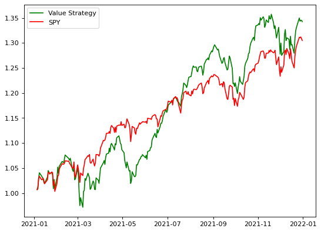

# Quantitative Value Screener

This project is on **value investing**, popularized by Warren Buffett, Benjamin Graham, Seth Glarman. Value investing refers to investing in stocks that are being traded below their perceived intrinsic value.

The core concept of our algorithmic value investing strategy is **multiples**, which is calculated by dividing a company's stock price by some measure of the company's worth such as earnings and assets. Common multiples in value investing are:
- Price-to-earnings (P/E) ratio = Share price / Earnings per share
    - The P/E ratio measures its current share price relative to its earnings per share (EPS) to value a company.
- Price-to-book-value (P/B) ratio = Market price per share / Book value per share
    - The P/B ratio measures the market's valuation of a company relative to its book value. 
    - The market value of equity is typically higher than the book value of a company. 
    - The P/B ratio is used by value investors to identify potential investments. 
    - P/B ratios under 1 are often considered solid investments.
- Price-to-free-cash-flow (P/CF) ratio = Share price / Cash flow per share
    - The P/CF ratio measures how much cash a company generates relative to its stock price.

Each mmultiple has its pros and cons. A way to minimize the impact of the cons of any specific multiple is by using a **composite**. For the investing strategy of my project, I will use a composite of five (5) distinct value investing metrics.

**Please refer to csv file for project result based on data as of Feb 19, 2022.**

## Backtest

## References
Investopedia
